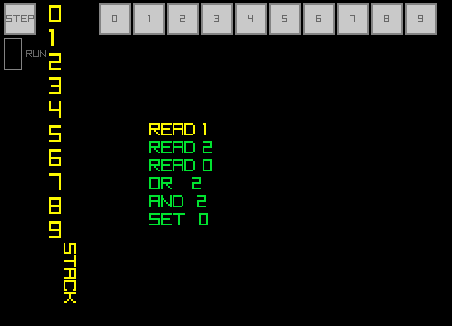

A little stack based VM written in C 



## usage

To use the vm, you need to give it a few methods, ReadPin, and write pin.

These are configured in the TVMCONFIG data type, this data type is also where you should put the pointer to a chunk of memory for the VM to use as its stack


``` c

void vm_write_pin(int p, int s); // you should impl thease methods 
int vm_read_pin(int p);


#define MAX_STACK 10
/* here we decl some space for our stack */
int g_stackMemory[MAX_STACK] = {0};

int main()
{
    TVM vm = {0};

    TVMCONFIG conf = {
        .read_pin = vm_read_pin,  // our read pin method
        .write_pin = vm_write_pin, // our write pin method
        .stack = g_stackMemory, // pointer to the stack
        .max_stack = MAX_STACK, // len of the stack
    };


    TVM_OPP exampleProgram[] = {
        (TVM_OPP){OPP_READ, 1}, // this will call the Read Method, with a 1 as pin
        (TVM_OPP){OPP_READ, 2},
        (TVM_OPP){OPP_READ, 0},
        (TVM_OPP){OPP_OR, 2}, // or the top 2 values togeather on the stack and store onto the stack
        (TVM_OPP){OPP_AND, 2},// and the top 2 values togeather on the stack and store onto the stack
        (TVM_OPP){OPP_SET, 0} // write_pin (0) with the value that is on the top of the stack
    };


    // load the values into our VM object
    tvm_init(&vm, &conf, exampleProgram, sizeof(exampleProgram) / sizeof(exampleProgram[0]);

    // now to run the vm, we just need a while loop
    while(true)
    {
        tvm_step(&vm); // Do a single instruction
        /*other work can be done here*/
    }

}
```